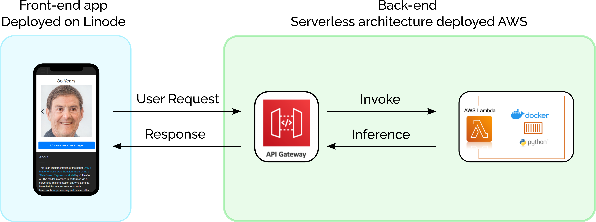

# Age Transformator: Deploy a Serverless Machine Learning App on AWS Lambda
This is an implementation of the paper [Only a Matter of Style: Age Transformation Using a Style-Based Regression Model](https://arxiv.org/abs/2102.02754) by Y. Alauf et al. The model inference is performed via a serverless implementation on AWS Lambda.

<a href="https://www.patrickstaehli.ch/age_transformator">&message=Try it!&color=green" height=22.5></a>  

<p align="center">

</p>

## App architecture 
After training and testing a machine learning model, the next step is to deploy it to make it available to the world. One way to do this is to use a serverless architecture (e.g using Lambda functions), where you don't have to provision servers yourself. 

The architecture of the app is as follows:
<p align="center">

</p>
The left side shows the front-end interface that is based on a Bootstrap template and hosted on a Linux system (Linode) using uWSGI and Nginx. The right side visualized the back-end, which consists of an API Gateway that communicates with the front-end via HTTP request, and the Lambda function that performs the age transformation. 

## Backend - Deployment of the Age Transformator 
### The Age Transformation Model
The model that was used in this project was developed and published by [Y. Alaluf et al.](https://arxiv.org/abs/2102.02754). I used the pre-trained model from the [original implementation](https://github.com/yuval-alaluf/SAM). Furthermore, the code borrows heavily from the [original implementation](https://github.com/yuval-alaluf/SAM) as well as from [pixel2style2pixel](https://github.com/eladrich/pixel2style2pixel).

### Using Amazon ECR with the AWS CLI
The following steps show how to push a container image to a private Amazon ECR repository for the first time using the Docker CLI and the AWS CLI. I developed and deployed this app from my personal computer through [Windows Subsystem for Linux](https://medium.com/@patrick.staehli_95233/how-to-install-and-use-linux-on-windows-11-with-wslg-9ff4ae5aaa47).

**Prerequisites**

You need to have an AWS account. As a new user, you will get a [free tier](https://aws.amazon.com/free/?trk=ps_a134p000003ykjoAAA&trkCampaign=acq_paid_search_brand&sc_channel=PS&sc_campaign=acquisition_DACH&sc_publisher=Google&sc_category=Core&sc_country=DACH&sc_geo=EMEA&sc_outcome=acq&sc_detail=aws%20free%20tier&sc_content=Account_e&sc_segment=454691194235&sc_medium=ACQ-P|PS-GO|Brand|Desktop|SU|AWS|Core|DACH|EN|Text|xx|non-EU&s_kwcid=AL!4422!3!454691194235!e!!g!!aws%20free%20tier&ef_id=EAIaIQobChMIvqPl3vTC9QIVKI9oCR2iTAS4EAAYASAAEgJaQPD_BwE:G:s&s_kwcid=AL!4422!3!454691194235!e!!g!!aws%20free%20tier&all-free-tier.sort-by=item.additionalFields.SortRank&all-free-tier.sort-order=asc&awsf.Free%20Tier%20Types=*all&awsf.Free%20Tier%20Categories=*all) offer that is available for 12 months following your AWS sign-up date. Although the free tier includes 400,000 seconds of computing time per month for AWS Lambda, which is more than enough for testing purposes, the free tier usage limit for the Amazon EC2 Container Registry (ECR) is only 500BM-month. Since the pre-trained model is larger (about 5GB), this will generate costs of about 0.75$ per month.

**Follow these steps to sign up for AWS and to install the CLI locally.**

- Sign up for AWS and create an IAM user. [This official documentation](https://docs.aws.amazon.com/AmazonECR/latest/userguide/get-set-up-for-amazon-ecr.html) will walk you through the necessary steps.
- Install the AWS Command Line Interface (CLI). [Official Documentation](https://docs.aws.amazon.com/cli/latest/userguide/getting-started-install.html).
- Create an Acces key for CLI via [AWS console](https://console.aws.amazon.com) -> Security credentials. Then, run the AWS configuration command and enter the credentials

```bash
$ aws configure
AWS Access Key ID [None]: < Access Key ID >
AWS Secret Access Key [None]: < Secret Access Key >
Default region name [None]: eu-central-1
Default output format [None]: json
```

**Authenticate to your default registry**

In order to push and pull images with Amazon ECR, authentication of the Docker CLI to the default registry is needed:
```bash
aws ecr get-login-password --region <REGION> | docker login --username AWS --password-stdin <AWS_ACCOUNT_ID>.dkr.ecr.<REGION>.amazonaws.com
```
Replace < REGION > with your region (e.g eu-central-1) and < AWS_ACCOUNT_ID > with your IAM's account id (format is 123456789101).

*Note: If you experience the error `Error saving credentials: error storing credentials - err: exit status 1`, you may have to delete `"credsStore": "osxkeychain"` in the `~/.docker/config.json` file.*

**Create a Repository**

```
aws ecr create-repository \
    --repository-name age-transformator \
    --image-scanning-configuration scanOnPush=true \
    --region eu-central-1
```

**Download the pre-trained models**

```bash
mkdir pretrained_models
pip install gdown
gdown "https://drive.google.com/u/0/uc?id=1XyumF6_fdAxFmxpFcmPf-q84LU_22EMC&export=download" -O pretrained_models/sam_ffhq_aging.pt
wget "https://github.com/italojs/facial-landmarks-recognition/raw/master/shape_predictor_68_face_landmarks.dat"
```

**Create a Docker image**

To create the Docker image, execute the following command inside the Backend folder
```
docker build -t age-transformator .
``` 

**Tag and push the docker image**

```
docker tag age-transformator:latest  <AWS_ACCOUNT_ID>.dkr.ecr.<REGION>.amazonaws.com/age-transformator:latest

docker push <AWS_ACCOUNT_ID>.dkr.ecr.<REGION>.amazonaws.com/age-transformator:latest
```


## Credits
This code borrows heavily from the [original implementation](https://github.com/yuval-alaluf/SAM)
